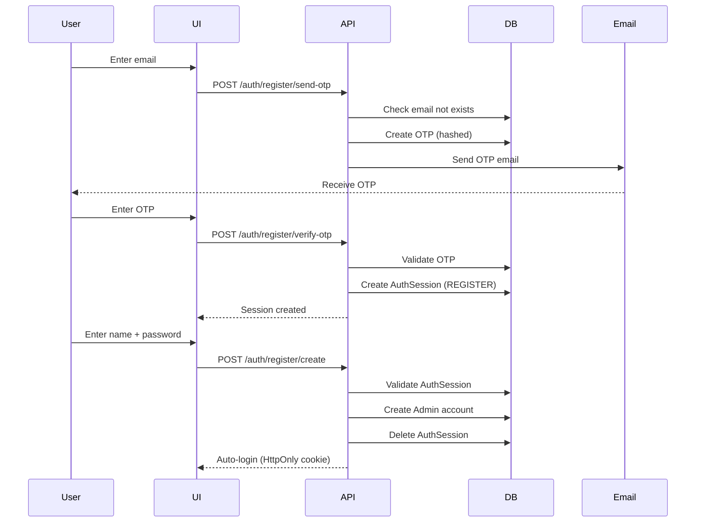
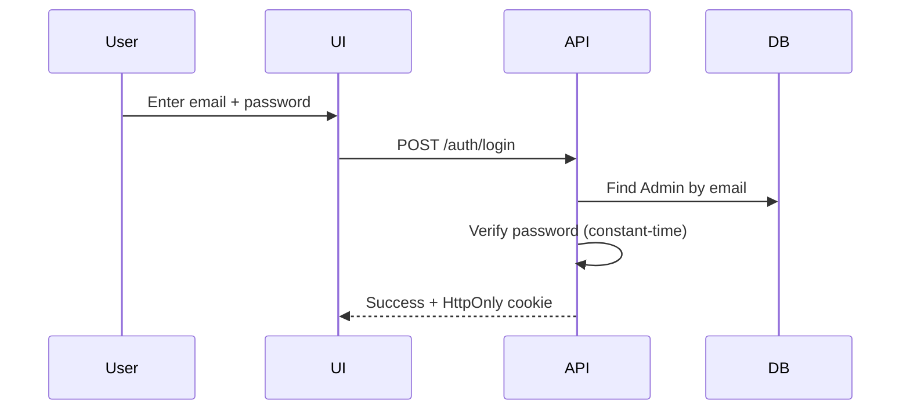
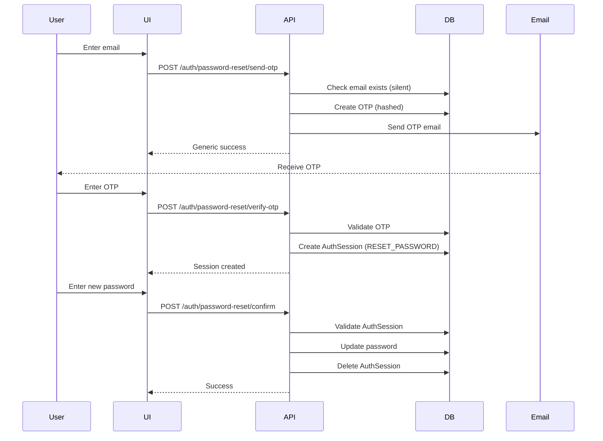

# Secure, Resumable Admin Authentication System

A production-grade, server-side admin authentication system built with Next.js 15, Prisma, PostgreSQL, and Resend email service.

## 🚀 Features

### Security-First Design
- ✅ **Intent-Based Authentication** - Strict isolation between LOGIN, REGISTER, and RESET_PASSWORD flows
- ✅ **OTP Verification** - 7-digit cryptographically secure OTPs for email verification
- ✅ **Constant-Time Operations** - Prevents timing attacks on password/OTP verification
- ✅ **Rate Limiting** - Configurable limits per action type (email + IP)
- ✅ **HttpOnly Cookies** - Secure session management
- ✅ **Password Strength Enforcement** - Server-side validation
- ✅ **Email Enumeration Protection** - Generic error messages
- ✅ **Single-Use OTPs** - Transaction-based enforcement
- ✅ **Race-Condition Safe** - Atomic database operations

### Resumable Flows
- **Registration**: Send OTP → Verify OTP → Create Account (each step resumable)
- **Password Reset**: Send OTP → Verify OTP → Confirm Password (each step resumable)
- **Session Expiry**: OTPs expire in 10 minutes, Auth sessions in 30 minutes

### Clean Architecture
- **SOLID Principles** - Single Responsibility, Open/Closed, Interface Segregation, Dependency Inversion
- **DRY (Don't Repeat Yourself)** - Reusable utilities and repositories
- **Repository Pattern** - Abstracted database operations
- **Type Safety** - Comprehensive TypeScript types
- **Separation of Concerns** - Clear module boundaries

## 📁 Project Structure

```
src/
├── lib/
│   ├── auth/
│   │   ├── types.ts                    # Type definitions and interfaces
│   │   ├── crypto.ts                   # Cryptographic utilities
│   │   ├── validation.ts               # Input validation
│   │   ├── email.ts                    # Email service (Resend)
│   │   ├── rate-limit.ts               # Rate limiting
│   │   ├── session.ts                  # Session management
│   │   ├── request-utils.ts            # Request helpers
│   │   ├── cleanup.ts                  # Cleanup jobs
│   │   └── repositories/
│   │       ├── admin.repository.ts      # Admin database operations
│   │       ├── otp.repository.ts        # OTP database operations
│   │       └── auth-session.repository.ts # AuthSession operations
│   └── prisma.ts                       # Prisma client singleton
├── app/
│   └── api/
│       └── auth/
│           ├── check-email/            # Email-first entry point
│           ├── login/                  # Direct login
│           ├── logout/                 # Session termination
│           ├── me/                     # Current user info
│           ├── register/
│           │   ├── send-otp/           # Send registration OTP
│           │   ├── verify-otp/         # Verify OTP, create session
│           │   └── create/             # Create account
│           ├── password-reset/
│           │   ├── send-otp/           # Send reset OTP
│           │   ├── verify-otp/         # Verify OTP, create session
│           │   └── confirm/            # Update password
│           └── cleanup/                # Cleanup jobs endpoint
└── prisma/
    └── schema.prisma                   # Database schema
```

## 🗄️ Database Schema

### Admin
- **id**: UUID (primary key)
- **email**: String (unique)
- **name**: String
- **passwordHash**: String (bcrypt)
- **createdAt**: DateTime
- **updatedAt**: DateTime

### AdminOtp
- **id**: UUID (primary key)
- **email**: String
- **codeHash**: String (bcrypt hashed OTP)
- **intent**: String (REGISTER | RESET_PASSWORD)
- **used**: Boolean (single-use enforcement)
- **expiresAt**: DateTime (10 minutes)
- **createdAt**: DateTime
- **Index**: (email, intent)

### AuthSession
- **id**: String (cryptographically secure)
- **email**: String
- **intent**: String (REGISTER | RESET_PASSWORD)
- **expiresAt**: DateTime (30 minutes)
- **createdAt**: DateTime
- **Index**: (email, intent)

## 🔐 Authentication Flows

### 1. Registration Flow



### 2. Login Flow



### 3. Password Reset Flow



## 📡 API Endpoints

### Entry Point

#### `POST /api/auth/check-email`
Email-first authentication entry point

**Request:**
```json
{
  "email": "user@example.com"
}
```

**Response (existing user):**
```json
{
  "success": true,
  "exists": true,
  "canLogin": true,
  "canResetPassword": true
}
```

**Response (new user):**
```json
{
  "success": true,
  "exists": false,
  "canRegister": true
}
```

### Login

#### `POST /api/auth/login`
Direct login with email and password

**Request:**
```json
{
  "email": "admin@example.com",
  "password": "SecurePass123!"
}
```

**Response:**
```json
{
  "success": true,
  "admin": {
    "id": "uuid-here",
    "email": "admin@example.com",
    "name": "Admin Name"
  }
}
```

### Registration

#### `POST /api/auth/register/send-otp`
Send registration OTP

#### `POST /api/auth/register/verify-otp`
Verify OTP and create resumable session

#### `POST /api/auth/register/create`
Create admin account (requires valid session)

### Password Reset

#### `POST /api/auth/password-reset/send-otp`
Send password reset OTP

#### `POST /api/auth/password-reset/verify-otp`
Verify OTP and create resumable session

#### `POST /api/auth/password-reset/confirm`
Confirm new password (requires valid session)

### Session Management

#### `POST /api/auth/logout`
Delete session and logout

#### `GET /api/auth/me`
Get current authenticated user

## 🛠️ Setup

See [SETUP.md](./SETUP.md) for detailed setup instructions.

### Quick Start

1. **Install dependencies:**
   ```bash
   npm install
   ```

2. **Configure environment variables:**
   Create `.env` with required variables (see SETUP.md)

3. **Generate Prisma client:**
   ```bash
   npx prisma generate
   ```

4. **Run database migration:**
   ```bash
   npx prisma migrate dev --name init_admin_auth
   ```

5. **Start development server:**
   ```bash
   npm run dev
   ```

## 🧪 Testing

### Manual Testing with cURL

See [SETUP.md](./SETUP.md) for complete testing commands.

### Automated Testing (Recommended)

```bash
# TODO: Add Jest/Vitest tests
npm run test
```

## 🔒 Security Features

| Feature | Implementation |
|---------|----------------|
| Password Hashing | bcrypt (12 salt rounds) |
| OTP Hashing | bcrypt (12 salt rounds) |
| OTP Generation | crypto.randomBytes (cryptographically secure) |
| Session ID | crypto.randomBytes (32 bytes) |
| Constant-Time Comparison | crypto.timingSafeEqual |
| Rate Limiting | In-memory (configurable per action) |
| Session Storage | HttpOnly, Secure, SameSite=Lax cookies |
| Intent Isolation | Database-enforced via intent field |
| Single-Use OTPs | Transaction-based enforcement |
| Email Enumeration | Generic error messages |

## 📊 Rate Limits

| Action | Max Attempts | Time Window |
|--------|-------------|-------------|
| Send OTP | 3 | 10 minutes |
| Verify OTP | 5 | 10 minutes |
| Login | 5 | 15 minutes |
| Check Email | 20 | 5 minutes |

## 🧹 Cleanup Jobs

### Manual Cleanup
```bash
curl -X POST http://localhost:3000/api/auth/cleanup
```

### Automated (Production)
Schedule cleanup to run every hour using:
- Vercel Cron Jobs
- AWS EventBridge
- GitHub Actions

## 🚨 Error Handling

All errors return a consistent format:

```json
{
  "success": false,
  "error": "Error message here"
}
```

### Common Error Codes
- `400` - Bad Request (validation error)
- `401` - Unauthorized (invalid credentials)
- `404` - Not Found (resource not found)
- `409` - Conflict (email already exists)
- `429` - Too Many Requests (rate limited)
- `500` - Internal Server Error

## 📜 Future Enhancements

- [ ] Add comprehensive unit and integration tests
- [ ] Implement 2FA/TOTP support
- [ ] Add Redis for distributed rate limiting
- [ ] Add audit logging for security events
- [ ] Implement password reset via magic link (alternative to OTP)
- [ ] Add account lockout after failed attempts
- [ ] Implement email change flow
- [ ] Add webhook notifications for security events
- [ ] Support for multiple admin roles/permissions
- [ ] Add session management UI (view/revoke active sessions)

## 📝 License

MIT

## 🙏 Acknowledgments

Built with:
- [Next.js 15](https://nextjs.org/)
- [Prisma](https://www.prisma.io/)
- [Resend](https://resend.com/)
- [bcrypt](https://github.com/kelektiv/node.bcrypt.js)
- [TypeScript](https://www.typescriptlang.org/)
